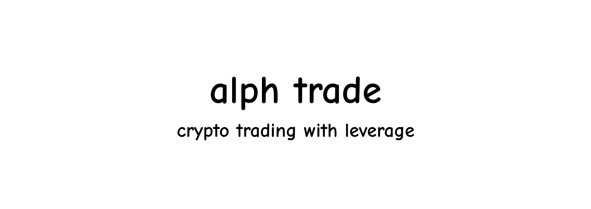
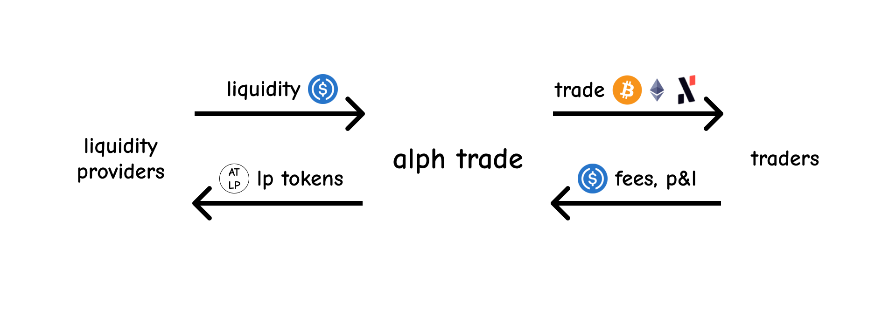

# Overview

**alph trade** (lowercase) is a synthetic perpetual futures exchange. Traders can open long or short positions on three different tokens: **BTC**, **ETH**, and **ALPH** (with more to come in the future) with up to **20x leverage**. Liquidity providers can deposit tokens into the liquidity pool to earn fees, as well as profit or loss (P&L) from the positions traders open.

## Oracle

The platform relies on the **DIA oracle** to deliver critical price data, ensuring accurate entry and close prices for trades. As more price feeds become available, alph trade will expand its offerings to support additional assets, enhancing the trading experience.

## Future

The protocol will receive ongoing updates with several key features planned, including:

- **Funding Rate**: A mechanism to better balance long and short positions, improving market stability.
- **Stop Loss/Take Profit**: This will allow traders to set automatic exit points for positions, helping them manage risk more effectively.
- **Increasing Collateral**: Traders will be able to add more collateral to their positions if the value drops to dangerous levels, reducing the risk of liquidation.
- **Liquidation Bot**: This feature will let users run programs that automatically liquidate positions when they fall below the liquidation threshold. It allows bot operators to earn fees and helps maintain the platform's stability and integrity.
- **More to Come**: Additional updates and features will continue to improve the overall trading and earning experience.

With each update, alph trade is committed to becoming a more robust and user-friendly platform, empowering traders and liquidity providers alike!
