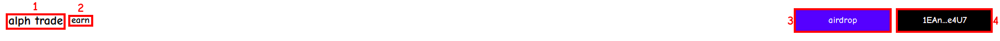
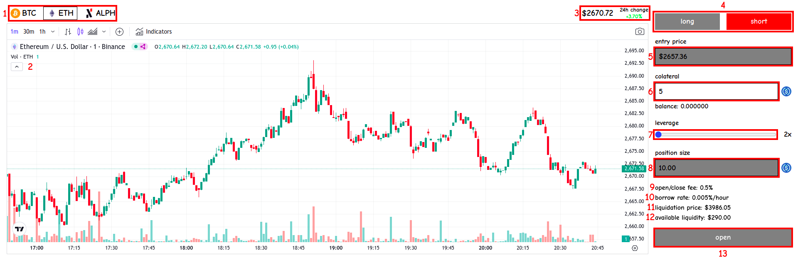
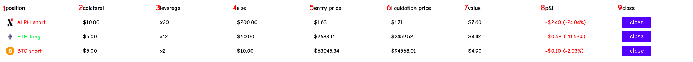
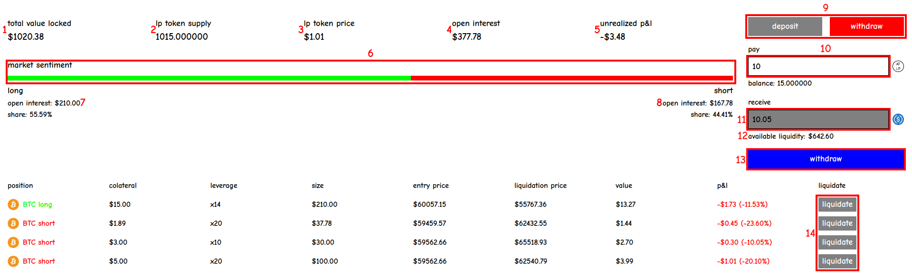

## Header

1. Trade Tab: Click on the logo to navigate to the Trade tab, where you can monitor current markets and open or close positions.
2. Earn Tab: Click on this tab to access the Earn section, where you can view statistics, deposit or withdraw liquidity, or perform liquidations.
3. Airdrop: Click here to receive an airdrop of 10 USDC (this holds no real value), which you can use to open positions or provide liquidity.
4. Wallet: Click here to connect or disconnect your wallet. If you're already connected, this displays your wallet address.

## Trade

1. Market Selector: Click on a specific token to switch to its market. Currently supported tokens are BTC, ETH, and ALPH.
2. Graph: Displays the price history of the selected token. Note that the price shown in the graph may differ slightly from the price used in the protocol — always refer to the price shown above the graph.
3. Price: The current price of the asset, used to open or close positions and calculate position values.
4. Long/Short Selector: Choose between a long or short position by clicking on the respective option.
5. Entry Price: The price that will be used as the entry point for your position. Depending on whether you go long or short, this may be slightly higher or lower than the market price.
6. Collateral: Enter the initial amount you are providing for your position.
7. Leverage: Select the leverage multiplier for your position (up to 20x).
8. Position Size: The current size of your position, calculated as collateral multiplied by leverage.
9. Open/Close Fee: The fee you pay to open and close positions, based on position size (higher position size increases the fee).
10. Borrow Rate: The hourly cost of borrowing liquidity, also based on position size (higher position size increases the fee).
11. Liquidation Price: The price at which your position will be liquidated, reducing its value to \$0.
12. Available Liquidity: The liquidity available for traders. Your position size must be below this amount.
13. Open Button: Once all parameters are set, click this button to open your position.

## Positions

1. Position: The underlying token and type (long/short) of position.
2. Collateral: The initial amount provided to open the position.
3. Leverage: The leverage applied to the position.
4. Size: The current size of the position, calculated as collateral multiplied by leverage.
5. Entry Price: The price at which you initially entered the position.
6. Liquidation Price: The price at which the position will be liquidated, causing its value to drop to \$0.
7. Value: The current value of the position, factoring in collateral, entry price, current price, and fees. This is the amount you will receive when you close the position.
8. Profit and Loss: Current profit or loss of the position, shown in both dollar value and percentage.
9. Close Button: Click this button to close the position.

## Earn

1. Total Value Locked (TVL): The total amount of liquidity provided by users.
2. LP Token Supply: The total number of tokens minted for liquidity providers.
3. LP Token Price: The current price of one LP token, which determines how much it can be withdrawn for.
4. Open Interest: The total size of all currently open positions.
5. Unrealized Profit and Loss: The combined profit or loss of all open positions — this represents the amount traders would gain or lose if all positions were closed at the current price.
6. Market Sentiment: The proportion of long and short positions currently open.
7. Long Stats: The total size of all long positions and their share of the overall market (both long and short).
8. Short Stats: The total size of all short positions and their share of the overall market (both long and short).
9. Deposit/Withdraw Selector: Choose whether to deposit or withdraw liquidity.
10. Pay: The amount of tokens (USDC or LP) you wish to deposit or withdraw.
11. Receive: The amount of tokens (USDC or LP) you will receive for your deposit or withdrawal.
12. Available Liquidity: The liquidity available for withdrawal (you can't withdraw more liquidity than what is needed to cover open positions).
13. Deposit/Withdraw Button: Click this button to deposit or withdraw liquidity.
14. Liquidate Button: Click this button to liquidate other traders' positions when their value drops below a certain percentage of collateral, earning a portion of their collateral as a reward.
